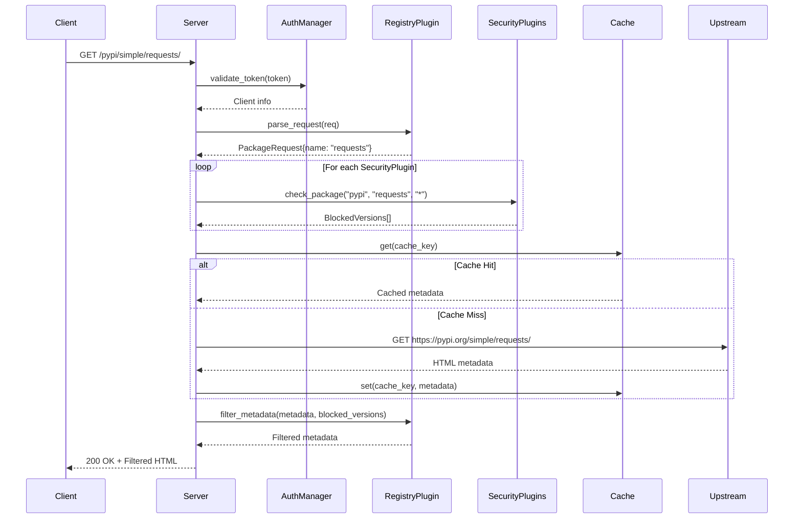
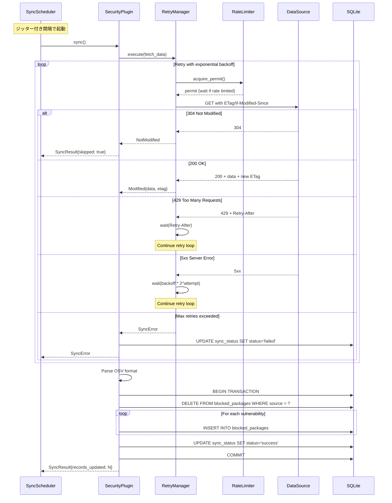

# 設計書

## アーキテクチャ概要

registry-firewallは、プラグインベースのモジュラーアーキテクチャを採用した統合レジストリプロキシです。コアエンジンがHTTPリクエストをルーティングし、レジストリプラグイン・セキュリティソースプラグイン・キャッシュプラグインが実際の処理を担当します。

### システム構成図

```
┌─────────────────────────────────────────────────────────────────────────────┐
│                          registry-firewall                                   │
│                                                                              │
│  ┌────────────────────────────────────────────────────────────────────────┐ │
│  │                           Core Engine                                   │ │
│  │  ┌──────────────┐  ┌──────────────┐  ┌──────────────┐  ┌────────────┐ │ │
│  │  │ HTTP Server  │  │ Auth Manager │  │ Plugin Loader│  │ Config Mgr │ │ │
│  │  │ (axum)       │  │              │  │              │  │ (YAML)     │ │ │
│  │  └──────────────┘  └──────────────┘  └──────────────┘  └────────────┘ │ │
│  └────────────────────────────────────────────────────────────────────────┘ │
│                          │                     │                             │
│           ┌──────────────┴──────────────┐     │                             │
│           ▼                             ▼     ▼                             │
│  ┌─────────────────────────┐  ┌─────────────────────────┐                  │
│  │  Registry Plugins       │  │  Security Source Plugins│                  │
│  │  ┌───────┐ ┌───────┐   │  │  ┌───────┐ ┌───────┐   │                  │
│  │  │ PyPI  │ │  Go   │   │  │  │  OSV  │ │OpenSSF│   │                  │
│  │  └───────┘ └───────┘   │  │  └───────┘ └───────┘   │                  │
│  │  ┌───────┐ ┌───────┐   │  │  ┌───────┐ ┌───────┐   │                  │
│  │  │ Cargo │ │ npm   │   │  │  │Custom │ │MinAge │   │                  │
│  │  └───────┘ └───────┘   │  │  └───────┘ └───────┘   │                  │
│  │  ┌───────┐             │  │                        │                  │
│  │  │Docker │             │  │                        │                  │
│  │  └───────┘             │  │                        │                  │
│  └─────────────────────────┘  └─────────────────────────┘                  │
│           │                             │                                   │
│           ▼                             ▼                                   │
│  ┌─────────────────────────────────────────────────────────────────────┐   │
│  │                         Shared Services                              │   │
│  │  ┌──────────────┐  ┌──────────────┐  ┌──────────────┐  ┌──────────┐│   │
│  │  │ Cache Layer  │  │ Block DB     │  │ OTEL Provider│  │ Web UI   ││   │
│  │  │ (FS/Redis)   │  │ (SQLite)     │  │              │  │ (embed)  ││   │
│  │  └──────────────┘  └──────────────┘  └──────────────┘  └──────────┘│   │
│  └─────────────────────────────────────────────────────────────────────┘   │
└─────────────────────────────────────────────────────────────────────────────┘
```

### レイヤー構成

| レイヤー | 責務 |
|---------|------|
| Presentation | HTTPサーバー、Web UI、APIエンドポイント |
| Application | リクエストパイプライン、認証、プラグイン連携 |
| Domain | ブロック判定ロジック、バージョンマッチング |
| Infrastructure | キャッシュ、DB、外部API連携、OTEL |

---

## 開発プロセス

### TDD（テスト駆動開発）

本プロジェクトはTDDで開発を進めます。すべての機能実装は以下のサイクルに従います。

#### Red-Green-Refactorサイクル

```
1. Red: 失敗するテストを書く
   ↓
2. Green: テストを通す最小限の実装
   ↓
3. Refactor: コードを改善（テストは通ったまま）
   ↓
1に戻る
```

#### テスト戦略

| テストレベル | 対象 | ツール |
|-------------|------|--------|
| ユニットテスト | 個別の関数・構造体 | `#[cfg(test)]` + `cargo test` |
| 統合テスト | モジュール間連携 | `tests/` ディレクトリ |
| E2Eテスト | API全体 | `reqwest` + テストサーバー |

#### テストカバレッジ目標

- ドメインロジック: 90%以上
- インフラストラクチャ: 70%以上
- 全体: 80%以上

#### モック戦略

```rust
// トレイトを使用してモック可能な設計
#[cfg_attr(test, mockall::automock)]
#[async_trait]
pub trait SecuritySourcePlugin: Send + Sync {
    fn name(&self) -> &str;
    async fn check_package(&self, ecosystem: &str, pkg: &str, version: &str) 
        -> Option<BlockReason>;
}
```

---

## コンポーネント

### Core Engine

#### HTTP Server

**目的**: HTTPリクエストの受信とルーティング

**責務**:
- プロキシエンドポイント（/pypi, /go, /cargo, /npm, /v2）のルーティング
- 管理エンドポイント（/ui, /api, /health, /metrics）のルーティング
- ミドルウェアチェーン（認証、ログ、トレース）の適用

**インターフェース**:
```rust
pub struct Server {
    router: Router,
    config: Arc<Config>,
    plugins: Arc<PluginManager>,
    auth: Arc<AuthManager>,
    otel: Arc<OtelProvider>,
}

impl Server {
    pub async fn new(config: Config) -> Result<Self, Error>;
    pub async fn run(self, shutdown: impl Future<Output = ()>) -> Result<(), Error>;
}
```

**テスト例**:
```rust
#[cfg(test)]
mod tests {
    use super::*;
    use axum_test::TestServer;

    #[tokio::test]
    async fn test_health_endpoint_returns_ok() {
        // Arrange
        let app = create_test_app().await;
        let server = TestServer::new(app).unwrap();
        
        // Act
        let response = server.get("/health").await;
        
        // Assert
        response.assert_status_ok();
    }
}
```

#### Auth Manager

**目的**: クライアント認証とアクセス制御

**責務**:
- APIトークンの検証
- Basic認証の処理
- トークンのCRUD操作
- レートリミット（認証失敗時）

**インターフェース**:
```rust
pub struct AuthManager {
    db: Arc<Database>,
    cache: TokenCache,
    rate_limiter: RateLimiter,
}

impl AuthManager {
    pub async fn validate_token(&self, token: &str) -> Result<Client, AuthError>;
    pub async fn validate_basic_auth(&self, user: &str, pass: &str) -> Result<Client, AuthError>;
    pub async fn create_token(&self, req: CreateTokenRequest) -> Result<Token, AuthError>;
    pub async fn revoke_token(&self, token_id: &str) -> Result<(), AuthError>;
    pub async fn list_tokens(&self) -> Result<Vec<Token>, AuthError>;
}
```

**テスト例**:
```rust
#[cfg(test)]
mod tests {
    use super::*;

    #[tokio::test]
    async fn test_validate_token_returns_client_for_valid_token() {
        // Arrange
        let db = MockDatabase::new();
        let manager = AuthManager::new(Arc::new(db));
        let token = manager.create_token(CreateTokenRequest {
            name: "test".into(),
            expires_at: None,
            allowed_ecosystems: vec!["pypi".into()],
        }).await.unwrap();
        
        // Act
        let result = manager.validate_token(&token.value).await;
        
        // Assert
        assert!(result.is_ok());
        assert_eq!(result.unwrap().name, "test");
    }

    #[tokio::test]
    async fn test_validate_token_returns_error_for_invalid_token() {
        // Arrange
        let db = MockDatabase::new();
        let manager = AuthManager::new(Arc::new(db));
        
        // Act
        let result = manager.validate_token("invalid_token").await;
        
        // Assert
        assert!(matches!(result, Err(AuthError::InvalidToken)));
    }
}
```

#### Plugin Loader

**目的**: プラグインの動的ロードと管理

**責務**:
- 設定に基づくプラグインのインスタンス化
- プラグインライフサイクル管理
- プラグイン間の依存解決

**インターフェース**:
```rust
pub struct PluginManager {
    registry_plugins: HashMap<String, Arc<dyn RegistryPlugin>>,
    security_plugins: Vec<Arc<dyn SecuritySourcePlugin>>,
    cache_plugin: Arc<dyn CachePlugin>,
}

impl PluginManager {
    pub fn from_config(cfg: &Config) -> Result<Self, PluginError>;
    pub fn get_registry_plugin(&self, name: &str) -> Option<Arc<dyn RegistryPlugin>>;
    pub fn security_plugins(&self) -> &[Arc<dyn SecuritySourcePlugin>];
    pub async fn shutdown(&self) -> Result<(), PluginError>;
}
```

---

### Registry Plugins

#### RegistryPlugin Trait

```rust
#[async_trait]
pub trait RegistryPlugin: Send + Sync {
    /// プラグイン名
    fn name(&self) -> &str;
    
    /// URLパスプレフィックス
    fn path_prefix(&self) -> &str;
    
    /// リクエスト解析
    fn parse_request(&self, req: &Request<Body>) -> Result<PackageRequest, ParseError>;
    
    /// リクエスト処理
    async fn handle_request(
        &self,
        ctx: RequestContext,
        req: Request<Body>,
    ) -> Result<Response<Body>, ProxyError>;
    
    /// メタデータフィルタリング
    fn filter_metadata(
        &self,
        metadata: &[u8],
        blocked: &[BlockedVersion],
    ) -> Result<Vec<u8>, FilterError>;
    
    /// キャッシュキー生成
    fn cache_key(&self, pkg: &str, version: &str) -> String;
}
```

#### PyPI Plugin

**目的**: PyPI Simple APIのプロキシ

**責務**:
- `/pypi/simple/{package}/` のメタデータ取得
- `/pypi/packages/{package}/{version}/{file}` のファイル取得
- HTML形式のメタデータからブロック対象バージョンを除外

**アップストリーム**: `https://pypi.org`

**テスト例**:
```rust
#[cfg(test)]
mod tests {
    use super::*;

    #[test]
    fn test_parse_simple_api_request() {
        // Arrange
        let plugin = PyPIPlugin::new(default_config());
        let req = Request::builder()
            .uri("/pypi/simple/requests/")
            .body(Body::empty())
            .unwrap();
        
        // Act
        let result = plugin.parse_request(&req);
        
        // Assert
        assert!(result.is_ok());
        let pkg_req = result.unwrap();
        assert_eq!(pkg_req.name, "requests");
        assert_eq!(pkg_req.request_type, RequestType::Metadata);
    }

    #[test]
    fn test_filter_metadata_removes_blocked_versions() {
        // Arrange
        let plugin = PyPIPlugin::new(default_config());
        let html = r#"
            <a href="requests-2.30.0.tar.gz">requests-2.30.0.tar.gz</a>
            <a href="requests-2.31.0.tar.gz">requests-2.31.0.tar.gz</a>
        "#;
        let blocked = vec![BlockedVersion {
            version: "2.31.0".into(),
            reason: "vulnerability".into(),
        }];
        
        // Act
        let result = plugin.filter_metadata(html.as_bytes(), &blocked);
        
        // Assert
        assert!(result.is_ok());
        let filtered = String::from_utf8(result.unwrap()).unwrap();
        assert!(filtered.contains("2.30.0"));
        assert!(!filtered.contains("2.31.0"));
    }
}
```

#### Go Module Plugin

**目的**: Go Module Proxyプロトコルのプロキシ

**責務**:
- `/{module}/@v/list` のバージョン一覧取得
- `/{module}/@v/{version}.info` のバージョン情報取得
- `/{module}/@v/{version}.mod` のgo.mod取得
- `/{module}/@v/{version}.zip` のソースコード取得

**アップストリーム**: `https://proxy.golang.org`

#### Cargo Plugin

**目的**: Cargo Sparse Indexのプロキシ

**責務**:
- `/cargo/{prefix}/{crate}` のインデックス取得
- `/cargo/crates/{crate}/{version}/download` のcrateファイル取得
- JSON Lines形式のインデックスからブロック対象バージョンを除外

**アップストリーム**:
- Index: `https://index.crates.io`
- Download: `https://static.crates.io/crates`

#### npm Plugin

**目的**: npm Registry APIのプロキシ

**責務**:
- `/{package}` のパッケージメタデータ取得
- `/@{scope}/{package}` のスコープ付きパッケージメタデータ取得
- `/{package}/-/{package}-{version}.tgz` のtarball取得
- JSON形式のメタデータからブロック対象バージョンを除外
- dist-tagsの自動更新（ブロックされたバージョンを指す場合）

**アップストリーム**: `https://registry.npmjs.org`

**特記事項**:
- スコープ付きパッケージ（@scope/package）はURLエンコード（%2F）に対応
- パッケージ名は大文字小文字を区別しない比較を実施

**テスト例**:
```rust
#[cfg(test)]
mod tests {
    use super::*;

    #[test]
    fn test_parse_scoped_package_request() {
        // Arrange
        let plugin = NpmPlugin::new();

        // Act - URL encoded format
        let result = plugin.parse_request("/npm/@types%2Fnode", "GET");

        // Assert
        assert!(result.is_ok());
        let pkg_req = result.unwrap();
        assert_eq!(pkg_req.name, "@types/node");
        assert_eq!(pkg_req.request_type, RequestType::Metadata);
    }

    #[test]
    fn test_parse_tarball_request() {
        // Arrange
        let plugin = NpmPlugin::new();

        // Act
        let result = plugin.parse_request("/npm/lodash/-/lodash-4.17.21.tgz", "GET");

        // Assert
        assert!(result.is_ok());
        let pkg_req = result.unwrap();
        assert_eq!(pkg_req.name, "lodash");
        assert_eq!(pkg_req.version, Some("4.17.21".into()));
        assert_eq!(pkg_req.request_type, RequestType::Download);
    }

    #[test]
    fn test_filter_metadata_removes_blocked_versions() {
        // Arrange
        let plugin = NpmPlugin::new();
        let json = r#"{
            "name": "lodash",
            "versions": {
                "4.17.20": {},
                "4.17.21": {}
            },
            "dist-tags": {
                "latest": "4.17.21"
            }
        }"#;
        let blocked = vec![BlockedVersion {
            version: "4.17.21".into(),
            reason: "vulnerability".into(),
        }];

        // Act
        let result = plugin.filter_metadata(json.as_bytes(), &blocked);

        // Assert
        assert!(result.is_ok());
        let filtered: serde_json::Value =
            serde_json::from_slice(&result.unwrap()).unwrap();
        assert!(!filtered["versions"].as_object().unwrap().contains_key("4.17.21"));
        // dist-tags.latestは4.17.20に更新される
        assert_eq!(filtered["dist-tags"]["latest"], "4.17.20");
    }
}
```

#### Docker Plugin

**目的**: Docker Registry API v2のプロキシ

**責務**:
- `/v2/{name}/manifests/{reference}` のマニフェスト取得
- `/v2/{name}/blobs/{digest}` のレイヤー取得
- `/v2/{name}/tags/list` のタグ一覧取得
- 認証トークンの中継

**アップストリーム**: `https://registry-1.docker.io`

---

### Security Source Plugins

#### SecuritySourcePlugin Trait

```rust
#[async_trait]
#[cfg_attr(test, mockall::automock)]
pub trait SecuritySourcePlugin: Send + Sync {
    /// プラグイン名
    fn name(&self) -> &str;
    
    /// 対応エコシステム
    fn supported_ecosystems(&self) -> &[String];
    
    /// データ同期（リトライ・負荷軽減込み）
    async fn sync(&self) -> Result<SyncResult, SyncError>;
    
    /// 同期間隔
    fn sync_interval(&self) -> Duration;
    
    /// 同期状態
    fn sync_status(&self) -> SyncStatus;
    
    /// パッケージチェック
    async fn check_package(
        &self,
        ecosystem: &str,
        pkg: &str,
        version: &str,
    ) -> Option<BlockReason>;
    
    /// ブロック対象一覧
    async fn get_blocked_packages(&self, ecosystem: &str) -> Vec<BlockedPackage>;
}
```

#### Sync Scheduler（自動更新機能）

**目的**: セキュリティソースの定期的な自動更新

**責務**:
- 設定された間隔での自動同期実行
- ジッター付きスケジューリング（同時リクエスト回避）
- 起動時の初期同期
- グレースフルシャットダウン

**インターフェース**:
```rust
pub struct SyncScheduler {
    plugins: Vec<Arc<dyn SecuritySourcePlugin>>,
    db: Arc<Database>,
    shutdown: broadcast::Receiver<()>,
}

impl SyncScheduler {
    pub fn new(
        plugins: Vec<Arc<dyn SecuritySourcePlugin>>,
        db: Arc<Database>,
        shutdown: broadcast::Receiver<()>,
    ) -> Self;
    
    /// スケジューラー開始（バックグラウンドタスク）
    pub async fn run(self);
    
    /// 手動同期トリガー
    pub async fn trigger_sync(&self, plugin_name: &str) -> Result<SyncResult, SyncError>;
}

#[derive(Debug, Clone)]
pub struct SchedulerConfig {
    /// 初期同期の遅延（秒）- 起動直後の負荷分散
    pub initial_delay_secs: u64,
    /// ジッター範囲（秒）- 同期タイミングのランダム化
    pub jitter_secs: u64,
    /// 同期タイムアウト（秒）
    pub sync_timeout_secs: u64,
}
```

**スケジューリングロジック**:
```rust
// ジッター付き次回実行時刻の計算
fn next_sync_time(interval: Duration, jitter_secs: u64) -> Instant {
    let jitter = rand::thread_rng().gen_range(0..jitter_secs);
    Instant::now() + interval + Duration::from_secs(jitter)
}
```

**テスト例**:
```rust
#[cfg(test)]
mod tests {
    use super::*;
    use tokio::time::{pause, advance};

    #[tokio::test]
    async fn test_scheduler_executes_sync_at_interval() {
        // Arrange
        pause(); // 時間を制御可能に
        let mut mock_plugin = MockSecuritySourcePlugin::new();
        mock_plugin.expect_name().returning(|| "test");
        mock_plugin.expect_sync_interval()
            .returning(|| Duration::from_secs(3600));
        mock_plugin.expect_sync()
            .times(2) // 初期 + 1回
            .returning(|| Ok(SyncResult::default()));
        
        let (tx, rx) = broadcast::channel(1);
        let scheduler = SyncScheduler::new(
            vec![Arc::new(mock_plugin)],
            Arc::new(MockDatabase::new()),
            rx,
        );
        
        // Act
        let handle = tokio::spawn(scheduler.run());
        advance(Duration::from_secs(3700)).await; // 1時間+α経過
        tx.send(()).unwrap(); // シャットダウン
        
        // Assert
        handle.await.unwrap();
        // mock_pluginのexpectationsが検証される
    }
}
```

#### Retry Manager（リトライ機能）

**目的**: 一時的な障害からの自動回復

**責務**:
- 指数バックオフによるリトライ
- 最大リトライ回数の制限
- リトライ可能なエラーの判別
- リトライ状態のログ出力

**インターフェース**:
```rust
#[derive(Debug, Clone)]
pub struct RetryConfig {
    /// 最大リトライ回数
    pub max_retries: u32,
    /// 初期バックオフ（秒）
    pub initial_backoff_secs: u64,
    /// 最大バックオフ（秒）
    pub max_backoff_secs: u64,
    /// バックオフ乗数
    pub backoff_multiplier: f64,
    /// ジッター有効化
    pub jitter: bool,
}

impl Default for RetryConfig {
    fn default() -> Self {
        Self {
            max_retries: 3,
            initial_backoff_secs: 5,
            max_backoff_secs: 300,
            backoff_multiplier: 2.0,
            jitter: true,
        }
    }
}

pub struct RetryManager {
    config: RetryConfig,
}

impl RetryManager {
    /// リトライ付きで非同期処理を実行
    pub async fn execute<F, Fut, T, E>(&self, operation: F) -> Result<T, E>
    where
        F: Fn() -> Fut,
        Fut: Future<Output = Result<T, E>>,
        E: RetryableError;
}

/// リトライ可能なエラーを判定するトレイト
pub trait RetryableError {
    fn is_retryable(&self) -> bool;
}
```

**バックオフ計算**:
```rust
fn calculate_backoff(&self, attempt: u32) -> Duration {
    let base = self.config.initial_backoff_secs as f64 
        * self.config.backoff_multiplier.powi(attempt as i32);
    let capped = base.min(self.config.max_backoff_secs as f64);
    
    let delay = if self.config.jitter {
        let jitter = rand::thread_rng().gen_range(0.0..1.0);
        capped * (0.5 + jitter * 0.5) // 50-100%のジッター
    } else {
        capped
    };
    
    Duration::from_secs_f64(delay)
}
```

**リトライ可能エラーの例**:
```rust
impl RetryableError for SyncError {
    fn is_retryable(&self) -> bool {
        match self {
            // リトライ可能
            SyncError::NetworkTimeout => true,
            SyncError::ConnectionRefused => true,
            SyncError::RateLimited(_) => true,
            SyncError::ServerError(code) if *code >= 500 => true,
            
            // リトライ不可
            SyncError::InvalidData(_) => false,
            SyncError::NotFound => false,
            SyncError::Unauthorized => false,
            _ => false,
        }
    }
}
```

**テスト例**:
```rust
#[cfg(test)]
mod tests {
    use super::*;
    use std::sync::atomic::{AtomicU32, Ordering};

    #[tokio::test]
    async fn test_retry_succeeds_after_transient_failure() {
        // Arrange
        let attempt_count = Arc::new(AtomicU32::new(0));
        let attempt_count_clone = attempt_count.clone();
        
        let manager = RetryManager::new(RetryConfig {
            max_retries: 3,
            initial_backoff_secs: 0, // テスト用に即時リトライ
            ..Default::default()
        });
        
        // Act
        let result = manager.execute(|| {
            let count = attempt_count_clone.fetch_add(1, Ordering::SeqCst);
            async move {
                if count < 2 {
                    Err(SyncError::NetworkTimeout) // 最初の2回は失敗
                } else {
                    Ok("success")
                }
            }
        }).await;
        
        // Assert
        assert!(result.is_ok());
        assert_eq!(attempt_count.load(Ordering::SeqCst), 3);
    }

    #[tokio::test]
    async fn test_retry_gives_up_after_max_retries() {
        // Arrange
        let manager = RetryManager::new(RetryConfig {
            max_retries: 2,
            initial_backoff_secs: 0,
            ..Default::default()
        });
        
        // Act
        let result: Result<(), SyncError> = manager.execute(|| async {
            Err(SyncError::NetworkTimeout)
        }).await;
        
        // Assert
        assert!(result.is_err());
    }
}
```

#### Rate Limiter（負荷軽減機能）

**目的**: 取得先サーバーへの負荷軽減

**責務**:
- リクエスト間隔の制御
- 同時リクエスト数の制限
- HTTP 429レスポンスへの対応
- ETag/If-Modified-Since対応

**インターフェース**:
```rust
#[derive(Debug, Clone)]
pub struct RateLimitConfig {
    /// 最小リクエスト間隔（ミリ秒）
    pub min_interval_ms: u64,
    /// 最大同時リクエスト数
    pub max_concurrent: usize,
    /// HTTP 429時の待機時間（秒）
    pub rate_limit_wait_secs: u64,
}

pub struct HttpClientWithRateLimit {
    client: reqwest::Client,
    semaphore: Arc<Semaphore>,
    last_request: Arc<Mutex<HashMap<String, Instant>>>,
    config: RateLimitConfig,
}

impl HttpClientWithRateLimit {
    pub async fn get(&self, url: &str) -> Result<Response, reqwest::Error>;
    
    /// ETag/Last-Modified対応GET
    pub async fn get_with_cache_headers(
        &self,
        url: &str,
        etag: Option<&str>,
        last_modified: Option<&str>,
    ) -> Result<ConditionalResponse, reqwest::Error>;
}

pub enum ConditionalResponse {
    /// 304 Not Modified
    NotModified,
    /// 200 OK with new data
    Modified {
        body: Bytes,
        etag: Option<String>,
        last_modified: Option<String>,
    },
}
```

**実装例**:
```rust
impl HttpClientWithRateLimit {
    pub async fn get_with_cache_headers(
        &self,
        url: &str,
        etag: Option<&str>,
        last_modified: Option<&str>,
    ) -> Result<ConditionalResponse, reqwest::Error> {
        // セマフォで同時リクエスト数を制限
        let _permit = self.semaphore.acquire().await.unwrap();
        
        // ドメイン単位でリクエスト間隔を制御
        self.wait_for_rate_limit(url).await;
        
        let mut req = self.client.get(url);
        
        // 条件付きGETヘッダー追加
        if let Some(etag) = etag {
            req = req.header("If-None-Match", etag);
        }
        if let Some(lm) = last_modified {
            req = req.header("If-Modified-Since", lm);
        }
        
        let response = req.send().await?;
        
        match response.status() {
            StatusCode::NOT_MODIFIED => Ok(ConditionalResponse::NotModified),
            StatusCode::OK => {
                let etag = response.headers()
                    .get("ETag")
                    .and_then(|v| v.to_str().ok())
                    .map(String::from);
                let last_modified = response.headers()
                    .get("Last-Modified")
                    .and_then(|v| v.to_str().ok())
                    .map(String::from);
                let body = response.bytes().await?;
                
                Ok(ConditionalResponse::Modified { body, etag, last_modified })
            }
            StatusCode::TOO_MANY_REQUESTS => {
                // Retry-Afterヘッダー対応
                let wait = response.headers()
                    .get("Retry-After")
                    .and_then(|v| v.to_str().ok())
                    .and_then(|v| v.parse().ok())
                    .unwrap_or(self.config.rate_limit_wait_secs);
                
                Err(SyncError::RateLimited(wait))
            }
            _ => response.error_for_status().map(|_| unreachable!()),
        }
    }
    
    async fn wait_for_rate_limit(&self, url: &str) {
        let domain = extract_domain(url);
        let mut last_requests = self.last_request.lock().await;
        
        if let Some(last) = last_requests.get(&domain) {
            let elapsed = last.elapsed();
            let min_interval = Duration::from_millis(self.config.min_interval_ms);
            if elapsed < min_interval {
                tokio::time::sleep(min_interval - elapsed).await;
            }
        }
        
        last_requests.insert(domain, Instant::now());
    }
}
```

#### OSV Plugin

**目的**: OSVデータベースからの脆弱性情報取得

**責務**:
- GCSバケットからの一括ダウンロード
- エコシステム別のフィルタリング
- 重大度によるフィルタリング
- 影響バージョン範囲の解析
- ETag/Last-Modifiedによる差分検出
- 自動リトライ・レートリミット

**データソース**: `gs://osv-vulnerabilities/{ecosystem}/all.zip`

**インターフェース**:
```rust
pub struct OsvPlugin {
    config: OsvConfig,
    http_client: Arc<HttpClientWithRateLimit>,
    retry_manager: RetryManager,
    db: Arc<Database>,
    cache_state: RwLock<OsvCacheState>,
}

#[derive(Debug, Clone)]
pub struct OsvConfig {
    /// 同期間隔（デフォルト: 3600秒 = 1時間）
    pub sync_interval_secs: u64,
    /// 対象エコシステム
    pub ecosystems: Vec<String>,
    /// 最小重大度フィルタ
    pub min_severity: Option<Severity>,
    /// リトライ設定
    pub retry: RetryConfig,
    /// レートリミット設定
    pub rate_limit: RateLimitConfig,
}

impl Default for OsvConfig {
    fn default() -> Self {
        Self {
            sync_interval_secs: 3600,
            ecosystems: vec!["PyPI".into(), "Go".into(), "crates.io".into()],
            min_severity: Some(Severity::Medium),
            retry: RetryConfig::default(),
            rate_limit: RateLimitConfig {
                min_interval_ms: 1000,  // 1秒間隔
                max_concurrent: 2,       // 同時2リクエストまで
                rate_limit_wait_secs: 60,
            },
        }
    }
}

/// キャッシュ状態（ETag/Last-Modified保持）
#[derive(Debug, Default)]
struct OsvCacheState {
    ecosystems: HashMap<String, EcosystemCache>,
}

#[derive(Debug, Clone)]
struct EcosystemCache {
    etag: Option<String>,
    last_modified: Option<String>,
    last_sync: DateTime<Utc>,
}
```

**同期処理フロー**:
```rust
impl OsvPlugin {
    async fn sync_ecosystem(&self, ecosystem: &str) -> Result<SyncResult, SyncError> {
        let url = format!(
            "https://storage.googleapis.com/osv-vulnerabilities/{}/all.zip",
            ecosystem
        );
        
        // キャッシュ状態取得
        let cache_state = self.cache_state.read().await;
        let cached = cache_state.ecosystems.get(ecosystem);
        let etag = cached.and_then(|c| c.etag.as_deref());
        let last_modified = cached.and_then(|c| c.last_modified.as_deref());
        drop(cache_state);
        
        // リトライ付きでダウンロード
        let response = self.retry_manager.execute(|| {
            self.http_client.get_with_cache_headers(&url, etag, last_modified)
        }).await?;
        
        match response {
            ConditionalResponse::NotModified => {
                tracing::info!(ecosystem, "OSV data not modified, skipping sync");
                Ok(SyncResult {
                    records_updated: 0,
                    skipped: true,
                })
            }
            ConditionalResponse::Modified { body, etag, last_modified } => {
                // ZIP展開・パース・DB更新
                let records = self.process_osv_zip(&body, ecosystem).await?;
                
                // キャッシュ状態更新
                let mut cache_state = self.cache_state.write().await;
                cache_state.ecosystems.insert(ecosystem.to_string(), EcosystemCache {
                    etag,
                    last_modified,
                    last_sync: Utc::now(),
                });
                
                Ok(SyncResult {
                    records_updated: records,
                    skipped: false,
                })
            }
        }
    }
}
```

**テスト例**:
```rust
#[cfg(test)]
mod tests {
    use super::*;
    use wiremock::{MockServer, Mock, ResponseTemplate};
    use wiremock::matchers::{method, path, header};

    #[tokio::test]
    async fn test_sync_skips_when_not_modified() {
        // Arrange
        let mock_server = MockServer::start().await;
        Mock::given(method("GET"))
            .and(path("/osv-vulnerabilities/PyPI/all.zip"))
            .and(header("If-None-Match", "\"abc123\""))
            .respond_with(ResponseTemplate::new(304))
            .mount(&mock_server)
            .await;
        
        let plugin = OsvPlugin::new_with_base_url(
            &mock_server.uri(),
            OsvConfig::default(),
        );
        
        // 事前にキャッシュ状態を設定
        plugin.set_cache_etag("PyPI", "\"abc123\"").await;
        
        // Act
        let result = plugin.sync_ecosystem("PyPI").await;
        
        // Assert
        assert!(result.is_ok());
        assert!(result.unwrap().skipped);
    }

    #[tokio::test]
    async fn test_sync_retries_on_transient_error() {
        // Arrange
        let mock_server = MockServer::start().await;
        let call_count = Arc::new(AtomicU32::new(0));
        let call_count_clone = call_count.clone();
        
        Mock::given(method("GET"))
            .and(path("/osv-vulnerabilities/PyPI/all.zip"))
            .respond_with_fn(move |_| {
                let count = call_count_clone.fetch_add(1, Ordering::SeqCst);
                if count < 2 {
                    ResponseTemplate::new(503) // 最初2回は503
                } else {
                    ResponseTemplate::new(200)
                        .set_body_bytes(create_test_osv_zip())
                }
            })
            .mount(&mock_server)
            .await;
        
        let plugin = OsvPlugin::new_with_base_url(
            &mock_server.uri(),
            OsvConfig {
                retry: RetryConfig {
                    max_retries: 3,
                    initial_backoff_secs: 0, // テスト用
                    ..Default::default()
                },
                ..Default::default()
            },
        );
        
        // Act
        let result = plugin.sync_ecosystem("PyPI").await;
        
        // Assert
        assert!(result.is_ok());
        assert_eq!(call_count.load(Ordering::SeqCst), 3);
    }

    #[tokio::test]
    async fn test_check_package_returns_block_reason_for_vulnerable_package() {
        // Arrange
        let plugin = OsvPlugin::new_with_test_data(vec![
            OsvEntry {
                id: "GHSA-1234".into(),
                affected: vec![Affected {
                    package: Package {
                        ecosystem: "PyPI".into(),
                        name: "requests".into(),
                    },
                    ranges: vec![Range {
                        range_type: "SEMVER".into(),
                        events: vec![
                            Event::Introduced("2.0.0".into()),
                            Event::Fixed("2.31.1".into()),
                        ],
                    }],
                }],
                severity: Some(Severity::High),
            },
        ]);
        
        // Act
        let result = plugin.check_package("pypi", "requests", "2.31.0").await;
        
        // Assert
        assert!(result.is_some());
        let reason = result.unwrap();
        assert_eq!(reason.source, "osv");
        assert_eq!(reason.advisory_id, Some("GHSA-1234".into()));
    }

    #[tokio::test]
    async fn test_check_package_returns_none_for_safe_package() {
        // Arrange
        let plugin = OsvPlugin::new_with_test_data(vec![]);
        
        // Act
        let result = plugin.check_package("pypi", "requests", "2.31.0").await;
        
        // Assert
        assert!(result.is_none());
    }
}
```

#### OpenSSF Malicious Plugin

**目的**: OpenSSF Malicious Packagesからのマルウェア情報取得

**責務**:
- Gitリポジトリのクローン/プル
- OSV形式のJSONファイル解析
- マルウェアパッケージの登録
- shallow clone + sparse checkoutによる帯域節約
- 自動リトライ・更新間隔制御

**データソース**: `https://github.com/ossf/malicious-packages.git`

**インターフェース**:
```rust
pub struct OpenSsfPlugin {
    config: OpenSsfConfig,
    retry_manager: RetryManager,
    db: Arc<Database>,
    repo_state: RwLock<RepoState>,
}

#[derive(Debug, Clone)]
pub struct OpenSsfConfig {
    /// 同期間隔（デフォルト: 1800秒 = 30分）
    pub sync_interval_secs: u64,
    /// 対象エコシステム
    pub ecosystems: Vec<String>,
    /// ローカルリポジトリパス
    pub repo_path: PathBuf,
    /// リトライ設定
    pub retry: RetryConfig,
    /// Git操作タイムアウト（秒）
    pub git_timeout_secs: u64,
}

impl Default for OpenSsfConfig {
    fn default() -> Self {
        Self {
            sync_interval_secs: 1800,
            ecosystems: vec!["pypi".into(), "npm".into(), "crates.io".into()],
            repo_path: PathBuf::from("/data/openssf-malicious"),
            retry: RetryConfig {
                max_retries: 3,
                initial_backoff_secs: 10,
                max_backoff_secs: 120,
                ..Default::default()
            },
            git_timeout_secs: 300,
        }
    }
}

#[derive(Debug, Default)]
struct RepoState {
    last_commit: Option<String>,
    last_sync: Option<DateTime<Utc>>,
}
```

**同期処理フロー（負荷軽減対応）**:
```rust
impl OpenSsfPlugin {
    async fn sync(&self) -> Result<SyncResult, SyncError> {
        let repo_path = &self.config.repo_path;
        
        // リトライ付きでGit操作実行
        self.retry_manager.execute(|| async {
            if repo_path.exists() {
                // 既存リポジトリ: fetch + reset
                self.git_pull_with_sparse().await
            } else {
                // 新規: shallow clone + sparse checkout
                self.git_clone_sparse().await
            }
        }).await?;
        
        // 差分検出
        let current_commit = self.get_head_commit().await?;
        let state = self.repo_state.read().await;
        
        if state.last_commit.as_ref() == Some(&current_commit) {
            tracing::info!("OpenSSF repository unchanged, skipping parse");
            return Ok(SyncResult { records_updated: 0, skipped: true });
        }
        drop(state);
        
        // OSVファイル解析・DB更新
        let records = self.parse_and_update_db().await?;
        
        // 状態更新
        let mut state = self.repo_state.write().await;
        state.last_commit = Some(current_commit);
        state.last_sync = Some(Utc::now());
        
        Ok(SyncResult { records_updated: records, skipped: false })
    }
    
    /// Sparse checkout で必要なディレクトリのみ取得
    async fn git_clone_sparse(&self) -> Result<(), SyncError> {
        let repo_url = "https://github.com/ossf/malicious-packages.git";
        
        // shallow clone (depth=1)
        Command::new("git")
            .args(["clone", "--depth", "1", "--filter=blob:none", 
                   "--sparse", repo_url])
            .arg(&self.config.repo_path)
            .timeout(Duration::from_secs(self.config.git_timeout_secs))
            .output()
            .await?;
        
        // sparse checkout設定（必要なエコシステムのみ）
        let sparse_paths: Vec<String> = self.config.ecosystems
            .iter()
            .map(|eco| format!("osv/{}", eco))
            .collect();
        
        Command::new("git")
            .current_dir(&self.config.repo_path)
            .args(["sparse-checkout", "set"])
            .args(&sparse_paths)
            .output()
            .await?;
        
        Ok(())
    }
    
    /// Pull時も差分のみ取得
    async fn git_pull_with_sparse(&self) -> Result<(), SyncError> {
        Command::new("git")
            .current_dir(&self.config.repo_path)
            .args(["fetch", "--depth", "1"])
            .timeout(Duration::from_secs(self.config.git_timeout_secs))
            .output()
            .await?;
        
        Command::new("git")
            .current_dir(&self.config.repo_path)
            .args(["reset", "--hard", "origin/main"])
            .output()
            .await?;
        
        Ok(())
    }
}
```

**テスト例**:
```rust
#[cfg(test)]
mod tests {
    use super::*;
    use tempfile::TempDir;

    #[tokio::test]
    async fn test_sync_skips_when_no_new_commits() {
        // Arrange
        let temp_dir = TempDir::new().unwrap();
        let plugin = OpenSsfPlugin::new_with_test_repo(
            temp_dir.path(),
            "abc123", // 現在のcommit
        );
        
        // 同じcommitを設定
        plugin.set_last_commit("abc123").await;
        
        // Act
        let result = plugin.sync().await;
        
        // Assert
        assert!(result.is_ok());
        assert!(result.unwrap().skipped);
    }

    #[tokio::test]
    async fn test_sync_updates_on_new_commits() {
        // Arrange
        let temp_dir = TempDir::new().unwrap();
        let plugin = OpenSsfPlugin::new_with_test_repo(
            temp_dir.path(),
            "def456", // 新しいcommit
        );
        
        plugin.set_last_commit("abc123").await; // 古いcommit
        
        // Act
        let result = plugin.sync().await;
        
        // Assert
        assert!(result.is_ok());
        assert!(!result.unwrap().skipped);
    }

    #[tokio::test]
    async fn test_sync_retries_on_git_failure() {
        // Arrange
        let plugin = OpenSsfPlugin::new_with_mock_git(|call_count| {
            if call_count < 2 {
                Err(SyncError::NetworkTimeout)
            } else {
                Ok(())
            }
        });
        
        // Act
        let result = plugin.sync().await;
        
        // Assert
        assert!(result.is_ok());
    }
}
```

#### Custom Blocklist Plugin

**目的**: カスタムブロックルールの適用

**責務**:
- YAMLファイルからのルール読み込み
- バージョン範囲のセマンティックバージョン解析
- ワイルドカードパターンマッチング
- Web UI経由でのルール更新

#### Minimum Age Plugin

**目的**: 新規公開パッケージのブロック

**責務**:
- パッケージ公開日時の取得
- 設定された最小経過時間との比較
- リアルタイムチェック（同期不要）

---

### Cache Layer

#### CachePlugin Trait

```rust
#[async_trait]
#[cfg_attr(test, mockall::automock)]
pub trait CachePlugin: Send + Sync {
    /// プラグイン名
    fn name(&self) -> &str;
    
    /// キャッシュ取得
    async fn get(&self, key: &str) -> Result<Option<CacheEntry>, CacheError>;
    
    /// キャッシュ保存
    async fn set(&self, key: &str, data: Bytes, meta: CacheMeta) -> Result<(), CacheError>;
    
    /// キャッシュ削除
    async fn delete(&self, key: &str) -> Result<(), CacheError>;
    
    /// 統計取得
    async fn stats(&self) -> CacheStats;
    
    /// 全削除
    async fn purge(&self) -> Result<(), CacheError>;
    
    /// 期限切れ削除
    async fn purge_expired(&self) -> Result<u64, CacheError>;
}

#[derive(Debug, Clone)]
pub struct CacheEntry {
    pub data: Bytes,
    pub meta: CacheMeta,
}

#[derive(Debug, Clone, Serialize, Deserialize)]
pub struct CacheMeta {
    pub size: u64,
    pub ttl: Duration,
    pub created_at: DateTime<Utc>,
    pub etag: Option<String>,
    pub content_type: String,
}
```

#### Filesystem Cache

**目的**: ローカルファイルシステムへのキャッシュ保存

**責務**:
- ディレクトリ構造でのファイル保存
- メタデータの.meta.jsonファイル管理
- LRUベースの容量管理
- TTL期限切れファイルの削除

**ストレージ構造**:
```
/data/cache/
├── pypi/
│   └── requests/
│       └── 2.31.0/
│           ├── requests-2.31.0.whl
│           └── requests-2.31.0.whl.meta.json
├── go/
│   └── github.com/
│       └── gin-gonic/
│           └── gin/
│               └── @v/
│                   ├── v1.9.1.zip
│                   └── v1.9.1.zip.meta.json
└── ...
```

#### Redis Cache（オプション）

**目的**: 高速メタデータキャッシュ

**責務**:
- メタデータのRedis保存
- ファイル実体はFilesystem Cacheと併用
- クラスタ対応

---

### Database

#### SQLite Schema

```sql
-- ブロックパッケージ
CREATE TABLE blocked_packages (
    id INTEGER PRIMARY KEY AUTOINCREMENT,
    ecosystem TEXT NOT NULL,
    package TEXT NOT NULL,
    version TEXT NOT NULL,
    source TEXT NOT NULL,
    reason TEXT,
    severity TEXT,
    advisory_id TEXT,
    created_at DATETIME DEFAULT CURRENT_TIMESTAMP,
    UNIQUE(ecosystem, package, version, source)
);

CREATE INDEX idx_blocked_eco_pkg ON blocked_packages(ecosystem, package);

-- 同期状態
CREATE TABLE sync_status (
    source TEXT PRIMARY KEY,
    last_sync_at DATETIME,
    status TEXT,
    error_message TEXT,
    records_count INTEGER
);

-- APIトークン
CREATE TABLE api_tokens (
    id TEXT PRIMARY KEY,
    name TEXT NOT NULL,
    token_hash TEXT NOT NULL,
    allowed_ecosystems TEXT,  -- JSON array or "*" for all
    expires_at DATETIME,
    created_at DATETIME DEFAULT CURRENT_TIMESTAMP,
    last_used_at DATETIME,
    is_revoked BOOLEAN DEFAULT FALSE
);

-- ブロックログ
CREATE TABLE block_logs (
    id INTEGER PRIMARY KEY AUTOINCREMENT,
    timestamp DATETIME DEFAULT CURRENT_TIMESTAMP,
    client_id TEXT,
    client_ip TEXT,
    ecosystem TEXT,
    package TEXT,
    version TEXT,
    source TEXT,
    reason TEXT
);

CREATE INDEX idx_block_logs_time ON block_logs(timestamp);

-- カスタムブロックルール
CREATE TABLE custom_rules (
    id INTEGER PRIMARY KEY AUTOINCREMENT,
    ecosystem TEXT NOT NULL,
    package_pattern TEXT NOT NULL,
    version_constraint TEXT NOT NULL,
    reason TEXT,
    created_at DATETIME DEFAULT CURRENT_TIMESTAMP,
    created_by TEXT
);
```

#### Database Trait

```rust
#[async_trait]
#[cfg_attr(test, mockall::automock)]
pub trait Database: Send + Sync {
    // Blocked packages
    async fn insert_blocked_package(&self, pkg: &BlockedPackage) -> Result<(), DbError>;
    async fn get_blocked_packages(&self, ecosystem: &str) -> Result<Vec<BlockedPackage>, DbError>;
    async fn is_blocked(&self, ecosystem: &str, pkg: &str, version: &str) -> Result<Option<BlockReason>, DbError>;
    async fn clear_blocked_by_source(&self, source: &str) -> Result<u64, DbError>;
    
    // Sync status
    async fn update_sync_status(&self, status: &SyncStatus) -> Result<(), DbError>;
    async fn get_sync_status(&self, source: &str) -> Result<Option<SyncStatus>, DbError>;
    
    // Tokens
    async fn create_token(&self, token: &Token) -> Result<(), DbError>;
    async fn get_token_by_hash(&self, hash: &str) -> Result<Option<Token>, DbError>;
    async fn revoke_token(&self, id: &str) -> Result<(), DbError>;
    async fn list_tokens(&self) -> Result<Vec<Token>, DbError>;
    
    // Block logs
    async fn insert_block_log(&self, log: &BlockLog) -> Result<(), DbError>;
    async fn get_block_logs(&self, limit: u32, offset: u32) -> Result<Vec<BlockLog>, DbError>;
    
    // Custom rules
    async fn insert_rule(&self, rule: &CustomRule) -> Result<i64, DbError>;
    async fn update_rule(&self, rule: &CustomRule) -> Result<(), DbError>;
    async fn delete_rule(&self, id: i64) -> Result<(), DbError>;
    async fn list_rules(&self) -> Result<Vec<CustomRule>, DbError>;
}
```

---

### OTEL Provider

**目的**: OpenTelemetry統合

**責務**:
- TracerProviderの初期化
- MeterProviderの初期化
- LoggerProviderの初期化
- OTLPエクスポーターの設定
- グレースフルシャットダウン

**インターフェース**:
```rust
pub struct OtelProvider {
    tracer: BoxedTracer,
    meter: Meter,
}

impl OtelProvider {
    pub fn new(config: &OtelConfig) -> Result<Self, OtelError>;
    pub fn tracer(&self) -> &BoxedTracer;
    pub fn meter(&self) -> &Meter;
    pub async fn shutdown(&self) -> Result<(), OtelError>;
}

// メトリクス定義
pub struct Metrics {
    pub requests_total: Counter<u64>,
    pub blocked_total: Counter<u64>,
    pub cache_hits_total: Counter<u64>,
    pub cache_misses_total: Counter<u64>,
    pub request_duration: Histogram<f64>,
    pub upstream_duration: Histogram<f64>,
    pub cache_size_bytes: ObservableGauge<u64>,
    pub blocked_packages_count: ObservableGauge<u64>,
}
```

**メトリクス定義**:

| 名前 | 種別 | 説明 |
|------|------|------|
| `registry_firewall_requests_total` | Counter | 総リクエスト数（ecosystem, status） |
| `registry_firewall_blocked_total` | Counter | ブロック数（ecosystem, source） |
| `registry_firewall_cache_hits_total` | Counter | キャッシュヒット数 |
| `registry_firewall_cache_misses_total` | Counter | キャッシュミス数 |
| `registry_firewall_request_duration_seconds` | Histogram | リクエスト処理時間 |
| `registry_firewall_upstream_duration_seconds` | Histogram | アップストリームレイテンシ |
| `registry_firewall_cache_size_bytes` | Gauge | キャッシュサイズ |
| `registry_firewall_blocked_packages_count` | Gauge | ブロック対象パッケージ数 |

---

### Web UI

**目的**: 管理用Webインターフェース

**責務**:
- ダッシュボード表示
- ブロックログ表示
- セキュリティDB状態表示
- キャッシュ管理
- カスタムルール管理
- トークン管理

**技術スタック**:
- フロントエンド: React + TypeScript + Tailwind CSS
- ビルド: Vite
- バンドル: rust-embedでRustバイナリに組み込み

**API エンドポイント**:

| Method | Path | 説明 |
|--------|------|------|
| GET | `/api/dashboard` | ダッシュボード統計 |
| GET | `/api/blocks` | ブロックログ一覧 |
| GET | `/api/security-sources` | セキュリティソース状態 |
| POST | `/api/security-sources/{name}/sync` | 手動同期 |
| GET | `/api/cache/stats` | キャッシュ統計 |
| DELETE | `/api/cache` | キャッシュクリア |
| GET | `/api/rules` | カスタムルール一覧 |
| POST | `/api/rules` | ルール追加 |
| PUT | `/api/rules/{id}` | ルール更新 |
| DELETE | `/api/rules/{id}` | ルール削除 |
| GET | `/api/tokens` | トークン一覧 |
| POST | `/api/tokens` | トークン生成 |
| DELETE | `/api/tokens/{id}` | トークン失効 |

---

## データフロー

### パッケージリクエストフロー



### セキュリティDB同期フロー



### 自動更新タイムライン

```
┌─────────────────────────────────────────────────────────────────────────────┐
│ 時刻  │ OSV Plugin (1h間隔)        │ OpenSSF Plugin (30m間隔)              │
├───────┼────────────────────────────┼───────────────────────────────────────┤
│ 00:00 │ 起動 → 初期同期            │ 起動 → 初期同期                       │
│ 00:05 │ (ジッター: +5min)          │                                       │
│ 00:30 │                            │ 定期同期 (304 Not Modified)           │
│ 01:00 │                            │ 定期同期 → 更新あり                   │
│ 01:07 │ 定期同期 (ジッター: +7min) │                                       │
│ 01:30 │                            │ 定期同期 (304 Not Modified)           │
│ ...   │                            │                                       │
└─────────────────────────────────────────────────────────────────────────────┘

※ 各同期にはジッター（0〜sync_interval*10%）が付与され、
  複数インスタンス稼働時の同時リクエストを回避
```

---

## 技術的決定事項

### 言語・フレームワーク

| 項目 | 選択 | 理由 |
|------|------|------|
| 言語 | Rust 1.75+ | メモリ安全性、高性能、シングルバイナリ |
| 非同期ランタイム | tokio | デファクトスタンダード |
| HTTPフレームワーク | axum | tower互換、型安全 |
| DB | rusqlite | 軽量、組み込み可能 |
| OTEL | opentelemetry-rust | 公式SDK |
| シリアライズ | serde | デファクトスタンダード |
| エラーハンドリング | thiserror + anyhow | 型安全なエラー定義 |
| テスト | cargo test + mockall | 標準ツールチェーン |
| Web UI埋め込み | rust-embed | ビルド時静的ファイル埋め込み |

### Rustクレート一覧

```toml
[dependencies]
# Async runtime
tokio = { version = "1", features = ["full", "process"] }

# Web framework
axum = { version = "0.7", features = ["macros"] }
tower = "0.4"
tower-http = { version = "0.5", features = ["cors", "trace", "compression-gzip"] }

# Serialization
serde = { version = "1", features = ["derive"] }
serde_json = "1"
serde_yaml = "0.9"

# Database
rusqlite = { version = "0.31", features = ["bundled"] }
tokio-rusqlite = "0.5"

# HTTP client
reqwest = { version = "0.12", features = ["json", "gzip"] }

# OpenTelemetry
opentelemetry = "0.22"
opentelemetry-otlp = "0.15"
opentelemetry_sdk = { version = "0.22", features = ["rt-tokio"] }
tracing = "0.1"
tracing-opentelemetry = "0.23"
tracing-subscriber = { version = "0.3", features = ["json", "env-filter"] }

# Security
argon2 = "0.5"
rand = "0.8"
base64 = "0.22"

# Version parsing
semver = "1"

# Utilities
chrono = { version = "0.4", features = ["serde"] }
bytes = "1"
async-trait = "0.1"
thiserror = "1"
anyhow = "1"
config = "0.14"

# Embed static files
rust-embed = "8"

# Git operations (for OpenSSF sync)
git2 = "0.18"

# Archive handling
zip = "0.6"
flate2 = "1"

# Concurrency control
tokio-util = "0.7"        # CancellationToken等

[dev-dependencies]
mockall = "0.12"
axum-test = "14"
tempfile = "3"
tokio-test = "0.4"
wiremock = "0.6"
```

### プラグインアーキテクチャ

| 決定 | 内容 |
|------|------|
| 方式 | トレイトベース（コンパイル時） |
| 理由 | Rustのdynamic loadingは複雑、トレイトオブジェクトで十分 |
| 拡張方法 | トレイト実装 + PluginManagerへの登録 |

### キャッシュ戦略

| 決定 | 内容 |
|------|------|
| デフォルト | ファイルシステムキャッシュ |
| TTL | レジストリ別に設定可能（デフォルト24h） |
| 容量管理 | LRU + 最大サイズ制限 |
| メタデータ | .meta.jsonファイルで管理 |

### セキュリティ

| 決定 | 内容 |
|------|------|
| トークン保存 | argon2idでハッシュ化 |
| トークン形式 | `rf_` プレフィックス + 32バイトランダム（Base64） |
| Basic認証 | パスワード部分をトークンとして扱う |
| レートリミット | 認証失敗10回で5分ブロック（IP単位） |

### エラーハンドリング

```rust
#[derive(Debug, thiserror::Error)]
pub enum AppError {
    #[error("Authentication failed: {0}")]
    Auth(#[from] AuthError),
    
    #[error("Plugin error: {0}")]
    Plugin(#[from] PluginError),
    
    #[error("Cache error: {0}")]
    Cache(#[from] CacheError),
    
    #[error("Database error: {0}")]
    Database(#[from] DbError),
    
    #[error("Upstream error: {0}")]
    Upstream(#[from] reqwest::Error),
}

impl IntoResponse for AppError {
    fn into_response(self) -> Response {
        let (status, message) = match &self {
            AppError::Auth(_) => (StatusCode::UNAUTHORIZED, self.to_string()),
            AppError::Plugin(_) => (StatusCode::INTERNAL_SERVER_ERROR, self.to_string()),
            // ...
        };
        
        (status, Json(json!({ "error": message }))).into_response()
    }
}
```

---

## ディレクトリ構造

```
registry-firewall/
├── Cargo.toml
├── Cargo.lock
├── src/
│   ├── main.rs
│   ├── lib.rs
│   ├── config/
│   │   ├── mod.rs
│   │   └── validation.rs
│   ├── server/
│   │   ├── mod.rs
│   │   ├── router.rs
│   │   └── middleware.rs
│   ├── auth/
│   │   ├── mod.rs
│   │   ├── manager.rs
│   │   ├── token.rs
│   │   └── ratelimit.rs
│   ├── sync/
│   │   ├── mod.rs
│   │   ├── scheduler.rs      # 自動更新スケジューラー
│   │   ├── retry.rs          # リトライマネージャー
│   │   └── http_client.rs    # レートリミット付きHTTPクライアント
│   ├── plugins/
│   │   ├── mod.rs
│   │   ├── registry/
│   │   │   ├── mod.rs
│   │   │   ├── traits.rs
│   │   │   ├── pypi.rs
│   │   │   ├── golang.rs
│   │   │   ├── cargo.rs
│   │   │   ├── npm.rs
│   │   │   └── docker.rs
│   │   ├── security/
│   │   │   ├── mod.rs
│   │   │   ├── traits.rs
│   │   │   ├── osv.rs
│   │   │   ├── openssf.rs
│   │   │   ├── custom.rs
│   │   │   └── minage.rs
│   │   └── cache/
│   │       ├── mod.rs
│   │       ├── traits.rs
│   │       ├── filesystem.rs
│   │       └── redis.rs
│   ├── database/
│   │   ├── mod.rs
│   │   ├── sqlite.rs
│   │   └── migrations.rs
│   ├── otel/
│   │   └── mod.rs
│   ├── webui/
│   │   ├── mod.rs
│   │   └── api.rs
│   ├── models/
│   │   ├── mod.rs
│   │   ├── package.rs
│   │   ├── block.rs
│   │   └── token.rs
│   └── error.rs
├── tests/
│   ├── common/
│   │   └── mod.rs
│   ├── integration_pypi.rs
│   ├── integration_auth.rs
│   ├── integration_cache.rs
│   └── integration_sync.rs   # 同期機能統合テスト
├── web/                      # React frontend source
│   ├── src/
│   ├── package.json
│   └── vite.config.ts
├── configs/
│   ├── config.yaml
│   └── custom-blocklist.yaml
├── deployments/
│   ├── docker/
│   │   └── Dockerfile
│   └── docker-compose/
│       ├── docker-compose.yaml
│       └── otel-collector-config.yaml
├── docs/
│   ├── requirements.md
│   ├── design.md
│   └── tasks.md
└── README.md
```

---

## 設定ファイル構造

```yaml
server:
  host: "0.0.0.0"
  port: 8080
  read_timeout_secs: 30
  write_timeout_secs: 60

auth:
  enabled: true
  admin_password: "${ADMIN_PASSWORD}"  # Web UI用
  rate_limit:
    max_failures: 10
    block_duration_secs: 300

registry_plugins:
  pypi:
    enabled: true
    path_prefix: "/pypi"
    upstream: "https://pypi.org"
    cache_ttl_secs: 86400

  go:
    enabled: true
    path_prefix: "/go"
    upstream: "https://proxy.golang.org"
    cache_ttl_secs: 86400

  cargo:
    enabled: true
    path_prefix: "/cargo"
    upstream: "https://index.crates.io"
    cache_ttl_secs: 86400
    options:
      dl_upstream: "https://static.crates.io/crates"

  npm:
    enabled: true
    path_prefix: "/npm"
    upstream: "https://registry.npmjs.org"
    cache_ttl_secs: 86400

  docker:
    enabled: true
    path_prefix: "/v2"
    upstream: "https://registry-1.docker.io"
    cache_ttl_secs: 3600

security_plugins:
  osv:
    enabled: true
    sync_interval_secs: 3600      # 1時間ごと
    ecosystems: ["pypi", "go", "cargo", "npm"]
    options:
      min_severity: "MEDIUM"
    retry:
      max_retries: 3
      initial_backoff_secs: 5
      max_backoff_secs: 300
    rate_limit:
      min_interval_ms: 1000       # 1秒間隔
      max_concurrent: 2

  openssf_malicious:
    enabled: true
    sync_interval_secs: 1800      # 30分ごと
    ecosystems: ["pypi", "go", "cargo", "npm"]
    options:
      repo_path: "/data/openssf-malicious"
      git_timeout_secs: 300
    retry:
      max_retries: 3
      initial_backoff_secs: 10
      max_backoff_secs: 120

  custom_blocklist:
    enabled: true
    sync_interval_secs: 300
    options:
      file_path: "/config/custom-blocklist.yaml"

  minimum_age:
    enabled: false
    options:
      min_age_hours: 72

cache:
  plugin: "filesystem"
  filesystem:
    base_path: "/data/cache"
    max_size_gb: 50

database:
  path: "/data/db/registry-firewall.db"

otel:
  enabled: true
  endpoint: "http://otel-collector:4317"
  insecure: true
  service_name: "registry-firewall"

webui:
  enabled: true
  path_prefix: "/ui"

logging:
  level: "info"
  format: "json"
```

---

## 変更履歴

| バージョン | 日付 | 変更内容 | 作成者 |
|-----------|------|----------|--------|
| 1.0 | 2025-12-02 | 初版作成 | - |
| 1.1 | 2025-12-02 | 実装言語をRustに変更、TDDプロセスを追加 | - |
| 1.2 | 2025-12-03 | 自動更新・リトライ・負荷軽減機能を追加 | - |
| 1.3 | 2025-12-10 | npmレジストリプラグインの仕様を追加 | - |
